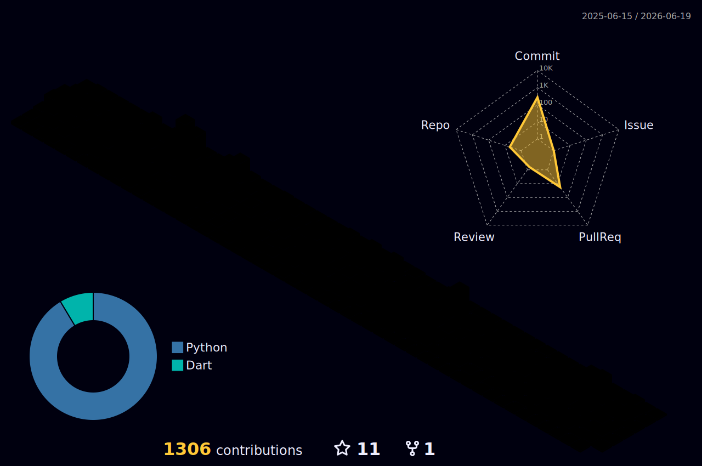

<!-- Profile Header -->

  
  
  
  

<h1 align="center">Welcome to my Github Profile!</h1>

  <i>Full-stack Flutter… Laravel… DevOps… I ship… I automate… I iterate</i>

---

## About Me
Hi… I’m **Dario Maselli** from South Africa… Italian by bloodline… builder by choice.  
I architect and ship mobile apps in **Flutter**, back them with **Laravel**, and wire the whole thing with **CI/CD** that actually earns its keep. I’m into **self-hosting**, **Cloudflare Tunnels**, **AWS**, **Docker**, **Fastlane**, **Shorebird**, and GitHub Actions that move fast without catching fire.

I enjoy all things space… and when I’m not pushing a release, I’m probably tweaking my homelab or catching a CS match.

---

## What I’m focused on right now
- 🚀 **Parket**… production-grade mobile… Django backend… sharp workflows  
- 🧪 **Testing**… unit… widget… integration… mocks that tell the truth  
- 🛠️ **Pipelines**… Fastlane… Shorebird… signed iOS builds… Play Console flows  

---

## Tooling & Tech I reach for

  
  
  
  
  
  
  
  
  
  
  
  

---

## Open Source… snippets that grew up
- 📚 **FlutterDevEssentials**… patterns… snippets… guardrails for Flutter projects  
- 🕸️ **WebDevEssentials**… small… sharp web utilities  

> If it removes toil… I’ll probably automate it

---

## My Streaks

---

## Contribution Cityline

---

## Stats… because results matter

  

  

---

## How I work
- CI first… manual steps belong in history  
- Small… verifiable changes… shipped often  
- Honest telemetry… logs over vibes… rollbacks ready

---

## Say hi
I’m always open to sharp problems… clean architectures… and pipelines that pay rent.  
Drop an issue… start a discussion… or ping me for collaboration

